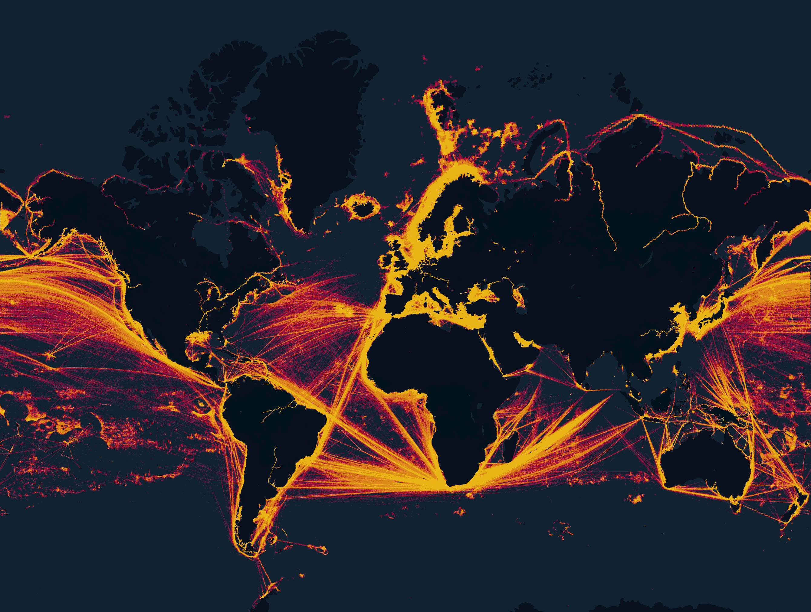

# DataDrivenPortIndex (DDPI)

## Overview
This project aims to create a comprehensive, data-driven database of international ports, based on AIS (Automatic Information System) data from global shipping. AIS data, transmitted via radio receivers, provides detailed movement information of ships worldwide, generating several gigabytes of data daily. The goal is to leverage this data to detect and map port locations, identify port boundaries, and eventually extract additional port-related properties.



## Objectives
 - Port Clustering: Detect recurring behavior in AIS data (such as ship arrivals, departures, or specific routes) that could indicate the presence of ports or port-related facilities.
 - Port Identification: Use clustering algorithms to group detected events into port clusters.
 - Port Metadata: For each port cluster, generate:
    * A unique identification number.
    * Port name.
    * Polygon representing port boundaries.
 - Distinguishing Ports and Anchorages: Develop methods to differentiate between entire ports and individual berths within those ports.
 - Future Extensions: Explore the possibility of extracting additional properties such as berth recognition and port draught.


## Build DDPI

```bash
curl -LsSf https://astral.sh/uv/install.sh | sh
```
```bash
uv run main.py
```
---

This project lays the foundation for a detailed and accurate port database that can be further expanded with more granular port attributes.