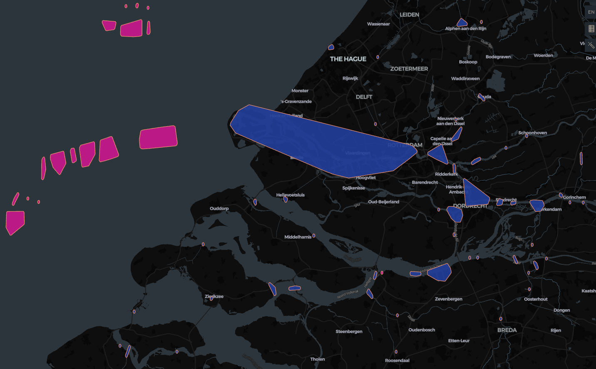

# DataDrivenPortIndex (DDPI)

## Overview

**DataDrivenPortIndex (DDPI)** is a project aimed at building a comprehensive, data-driven database of international ports using AIS (Automatic Identification System) data from global shipping traffic. AIS data, transmitted via radio signals, provides granular insights into ship movements, generating several gigabytes of data daily. By leveraging this wealth of information, DDPI seeks to accurately detect and map port locations, define port boundaries, and extract additional port-related attributes.

This project is designed as a robust foundation for creating an accurate and detailed port database that can be enriched with further properties as it evolves.

---

## Objectives

### Core Goals:
1. **Port Clustering**  
   Detect recurring [patterns](doc/port_events/) in AIS data—such as ship arrivals, departures, or common movement patterns—that signal the presence of ports or port-related facilities.

2. **Port Identification**  
   Use clustering algorithms to group detected events into distinct port clusters.

3. **Port Metadata Generation**  
   For each identified port cluster, generate key attributes:
   - A unique identification number.
   - Port name.
   - A polygon representing the port's boundaries.

4. **Port and Anchorage Differentiation**  
   Develop methods to distinguish between entire ports and anchorages.

### Future Extensions:
- **Berth Recognition**  
  Identify individual berths within a port to achieve finer granularity.
- **Port Characteristics**  
  Extract additional properties such as draught information, cargo handling capabilities, or other operational attributes.

---

## Getting Started

### Prerequisites
Ensure that the necessary tools and dependencies are installed.

#### Install the Build System:
```bash
curl -LsSf https://astral.sh/uv/install.sh | sh
```

#### Set Environment Variables
Create a `.env` file in the root directory and define the following variables:

- `AIS_INPUT_DIRECTORY`  
  Directory containing raw AIS data.
- `AIS_SIMPLIFIED_DIRECTORY`  
  Directory to store simplified AIS data after preprocessing.
- `AIS_PORT_EVENTS_DIRECTORY`  
  Directory to store extracted port event data.
- `AIS_VALIDATED_PORT_EVENTS_DIRECTORY`  
  Directory for validated port event data.

### Running the Project
Execute the main script to process the AIS data and generate port information:

```bash
uv run main.py
```

---

## Features

- **Comprehensive Port Database**  
  Aims to provide detailed insights into ports worldwide, including boundaries and metadata.
- **Data-Driven Approach**  
  Leverages AIS data and clustering algorithms to ensure accuracy and scalability.
- **Future-Proof Design**  
  Built with extensibility in mind for adding berth recognition and other advanced features.

---



---

DDPI is a step toward building a precise and scalable port database for global shipping and logistics. This platform is designed to evolve, enabling more granular analysis and operational insights into maritime transport hubs.
