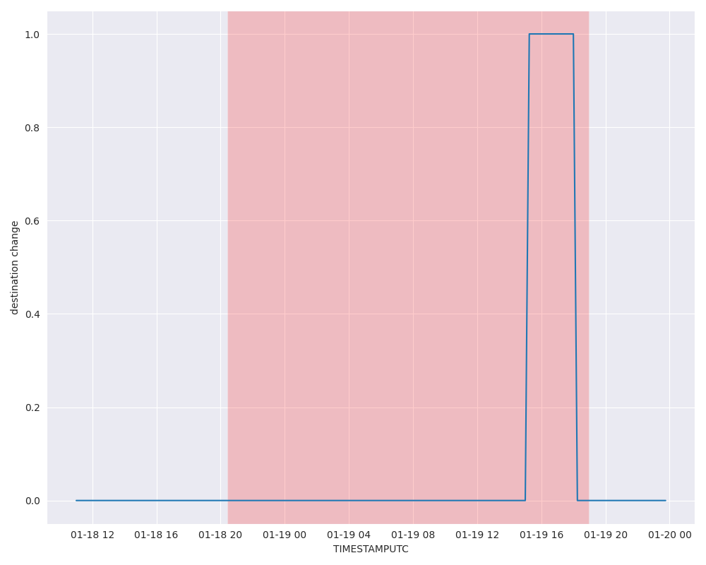

# Destination Changed Event

## Overview

The **destination_changed_event** is a type of port event within the DDPI system that captures changes in the `Destination` field from AIS data. The `Destination` field indicates the intended port or location a vessel is heading towards. Monitoring changes in this field provides valuable insights into vessel routing decisions, port call schedules, and potential deviations from planned routes.

## Example

