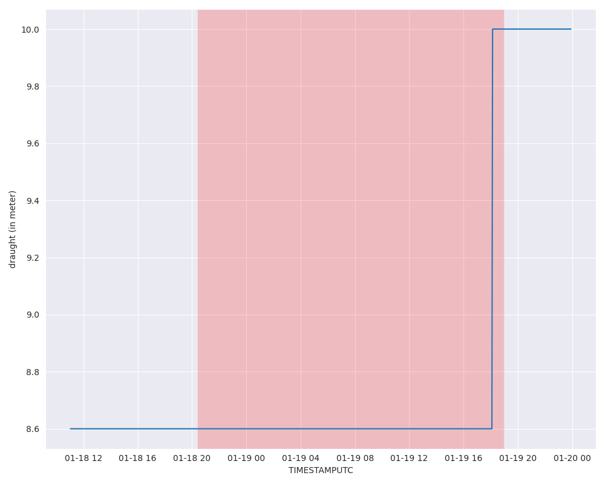

# Draught Changed Event

## Overview

The **draught_chenged_event** is a type of port event within the DDPI system that captures changes in the `Draught` field from AIS data. The draught of a vessel, typically measured in meters, reflects the depth of the ship's keel below the waterline. Changes in this field often indicate significant operational activities, such as loading or unloading cargo, which are key indicators of port interactions.

## Example

