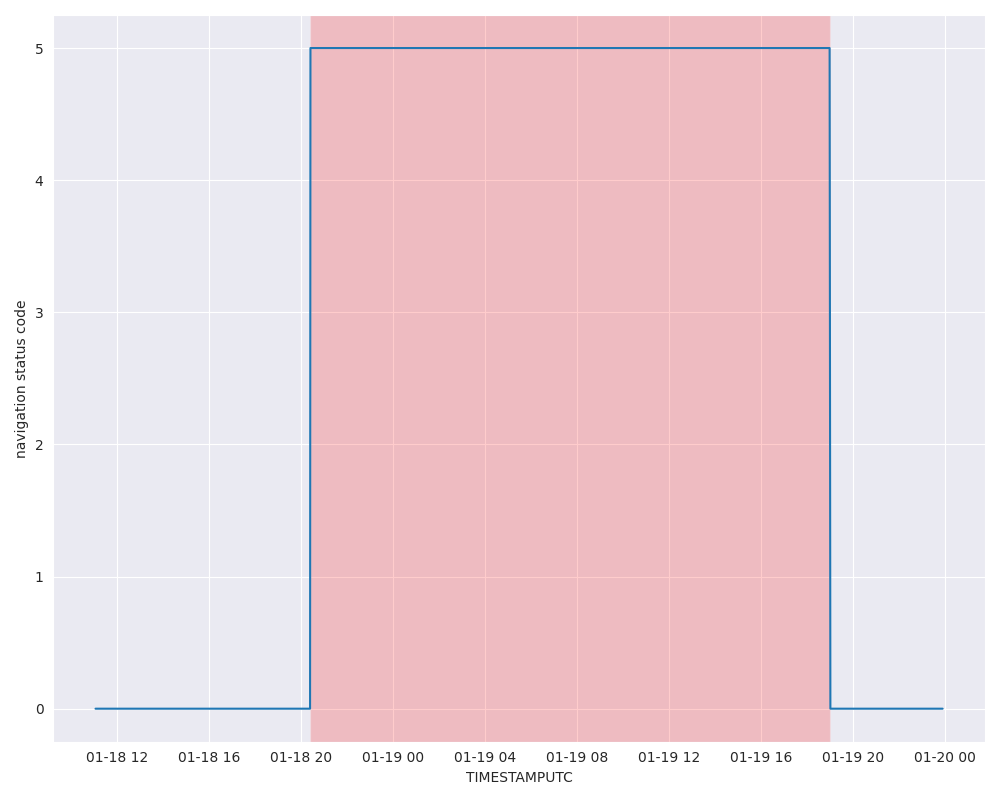

# Nav Status Code Changed Event

## Overview

The **nav_status_chenged_event** represents a specific type of event in the DDPI port events system, triggered when a ship's navigation status (`Nav Status`) field in AIS data changes. This event provides critical insights into vessel activity, particularly in and around ports, as it tracks changes in the operational state of ships (e.g., moving, anchored, or moored).

## Navigation Status Codes

The AIS `Nav Status` field uses integer codes to represent different navigation states. Examples include:
- **0**: Underway using engine
- **1**: At anchor
- **2**: Not under command
- **3**: Restricted maneuverability
- **4**: Constrained by her draught
- **5**: Moored
- **6**: Aground

## Example
