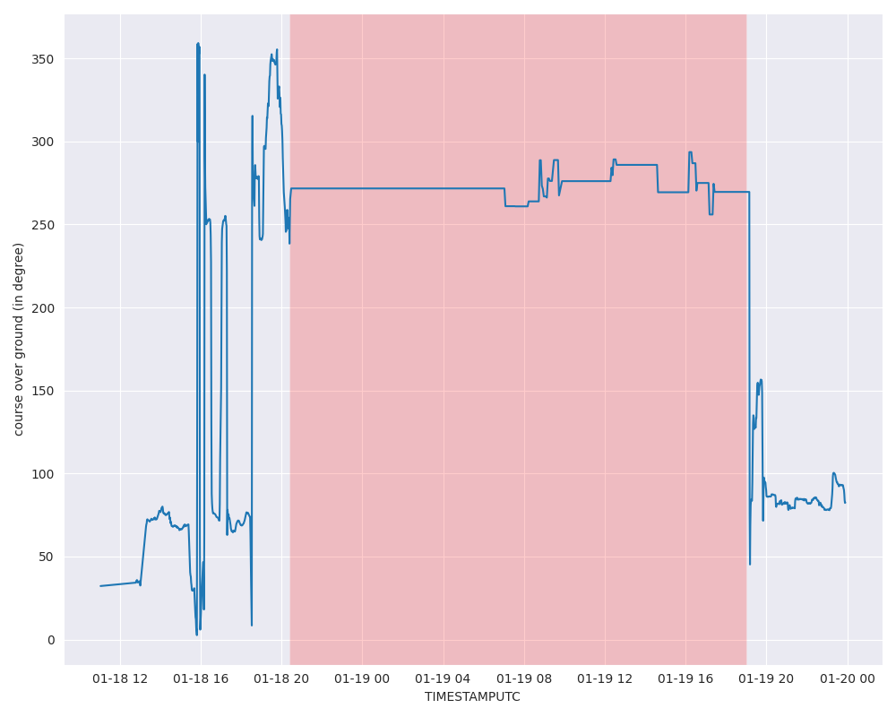

# Port-Event: No Course Over Ground Event

## Overview

The **no_course_over_ground_event** is a type of port event within the DDPI system that monitors the `Course Over Ground (COG)` field from AIS data to detect moments when there are no significant changes in the vessel's course. A lack of changes in the COG field often indicates that the vessel is stationary, which is common for ships anchored, moored, or otherwise stopped within a port area. This event is valuable for identifying periods of inactivity or stable positioning of vessels in port operations.

## Example

