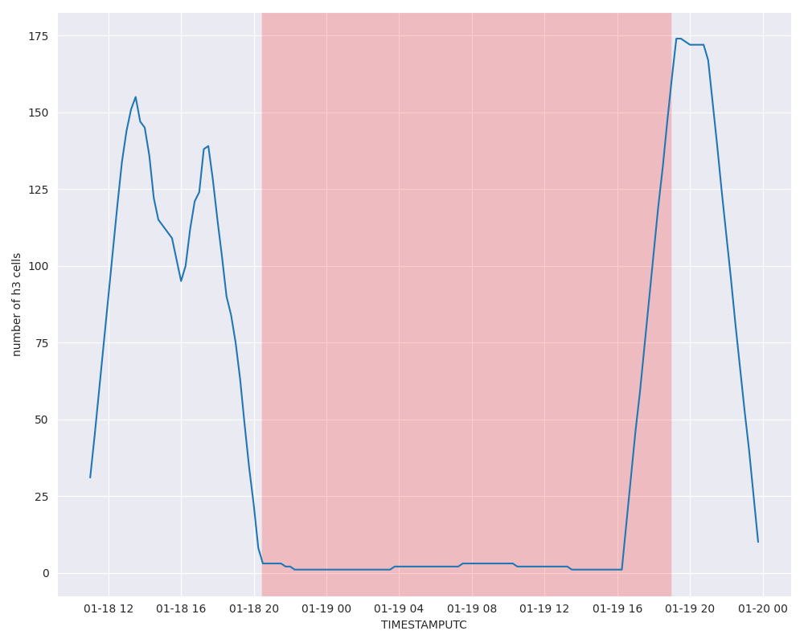

# No Movement Event

## Overview

The **no_movement_event**  is a specialized port-related event within the DDPI system that is triggered when a vessel's position, represented by its `Latitude` oder `Longitude`, remains within the same H3 cell for a defined time period. H3 is a hierarchical geospatial indexing system that divides the Earth's surface into hexagonal cells. If a vessel does not leave its current H3 cell during the specified timeframe, the event is triggered.

This event indicates prolonged stationary behavior, such as anchoring, mooring, or waiting within or near a port. By leveraging the precision of H3 cells, the event provides accurate and efficient detection of stationary periods, enabling better insights into vessel operations such as loading, unloading, or queueing for berthing. It also plays a crucial role in monitoring port traffic, analyzing congestion, and validating maritime activities.

## Example
